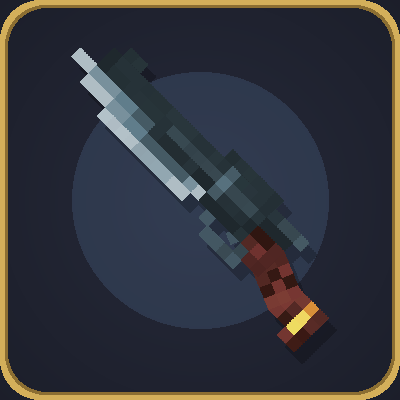

# Craftsman Gunblade (gun_and_weapon)

剣と銃のハイブリッド武器「ガンブレード」を追加する Minecraft Forge 1.20.1 MOD。
**TACZ (Timeless and Classics Zero)** と **The four primitives and Weapons** の連携アドオン。

Chuzume氏のデータパック『[Craftsman Arms](https://github.com/Chuzume/Craftsman_Arms)』の
Craftsman Gunblade をMODとして再現したものです（ご本人の許諾を得て使用）。



## 特徴

1つのアイテム（`gun_and_weapon:gunblade_sword`）が NBT でモードを切り替える統合武器:

| 操作 | 動作 |
|---|---|
| **[F]** (持ち替えキー) | 近接モード ⇔ 射撃モードの切替 |
| ⚔ 近接: 左クリック | 通常攻撃・コンボ (MAWのモーション/斬撃エフェクト) |
| ⚔ 近接: 左クリック長押し | **チャージスマッシュ** — 残弾を全消費して炎のリングを放つ (消費弾数で威力上昇) |
| ⚔ 近接: 右クリック | バレットステップ (突進攻撃・満腹度消費) |
| ⚔ 近接: スニーク+右クリック | ガード (タイミングでパリィ) |
| 🔫 射撃: 左クリック | セミオート射撃 (TACZ・12ゲージ) |
| 🔫 射撃: 右クリック | エイム |
| 🔫 射撃: [R] | リボルバー風リロード (シリンダー回転) |

- 両モードは同一アイテムなので、**エンチャント・名前・残弾・カスタムNBTがすべて引き継がれる**
- エンチャントはサバイバルで付与可能（テーブル / 金床。銃状態でも金床+本でOK）
- MAWのスキル画面に両モードとも対応（チャージ枠に `charge_smash` 登録済み）
- インベントリ・ドロップ・額縁の見た目は剣モデルに統一
- 発砲でシリンダーが回転

## 前提MOD

- [TACZ (Timeless and Classics Zero)](https://www.curseforge.com/minecraft/mc-mods/timeless-and-classics-zero) 1.1.7+
- [The four primitives and Weapons](https://github.com/Drowse-Lab/The-four-primitives-and-Weapons)

## ビルド

```bash
bash build.sh            # 通常ビルド (対話で version / release type を選択)
bash build.sh clean      # クリーンビルド
bash build.sh offline    # オフラインビルド
```

jar は `build/libs/gun_and_weapon-<version>.jar` に出力。

```bash
bash run_client.sh       # 本体MODをビルドしてから dev クライアント起動
bash run_quick.sh        # 手元のjarのまま即起動
```

## 開発メモ

- **剣モデルが唯一のソース**: `models/item/gunblade_sword.json` を Blockbench で編集すると、
  起動時に銃側 (TACZ geo / テクスチャ / アイコン) が自動生成される。
  → [BLOCKBENCH_GUIDE.md](BLOCKBENCH_GUIDE.md)
- TACZ ガンパック製作の知見: [docs/GUNPACK_NOTES.md](docs/GUNPACK_NOTES.md)
- CurseForge 掲載用テキスト: [CURSEFORGE.md](CURSEFORGE.md)

## インストール

1. `gun_and_weapon-<version>.jar` を `.minecraft/mods/` へ
2. TACZ と The four primitives and Weapons も `mods/` へ
3. 旧バージョンから更新する場合は `.minecraft/tacz/gunblade_pack/` を一度削除
   (毎起動時に自動再生成される)

## クレジット

- **オリジナルデザイン・モデル・テクスチャ**: [Chuzume](https://chuzume.hatenablog.jp/) 氏
  - 原作: [Craftsman Arms データパック](https://github.com/Chuzume/Craftsman_Arms)
  - リソース: Chuzume's Resources
  - ご本人の許諾を得て使用しています (条件: 原作リンクの掲載)
- MOD化: hrmcn
